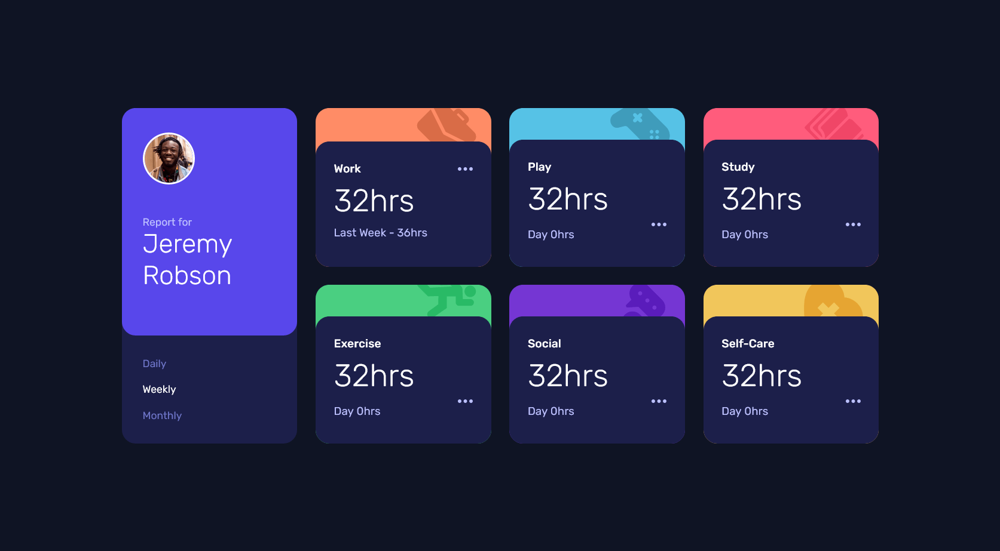

# Frontend Mentor - Time tracking dashboard solution

This is a solution to the [Time tracking dashboard challenge on Frontend Mentor](https://www.frontendmentor.io/challenges/time-tracking-dashboard-UIQ7167Jw). Frontend Mentor challenges help you improve your coding skills by building realistic projects.

## Table of contents

- [Overview](#overview)
  - [The challenge](#the-challenge)
  - [Screenshot](#screenshot)
  - [Links](#links)
  - [Built with](#built-with)
  - [Author](#author)

## Overview

### The challenge

Users should be able to:

- View the optimal layout for the site depending on their device's screen size
- See hover states for all interactive elements on the page
- Switch between viewing Daily, Weekly, and Monthly stats

### Screenshot

### Links

- Solution URL: [News Homepage Main ↗](https://www.frontendmentor.io/solutions/time-tracking-dashboard-sOdlH43M8O)
- Live Site URL: [Link ↗](https://itsdevdeepak.github.io/time-tracking-dashboard-main)

### Built with

- Semantic HTML5 markup
- CSS custom properties
- Flexbox
- Css Grid
- Javascript
- Mobile-first workflow

### Author

- Twitter - [@itsdevdeepak ↗](https://www.twitter.com/itsdevdeepak)
- Linkedin - [@itsdevdeepak ↗](https://www.linkedin.com/in/itsdevdeepak)
- Frontend Mentor - [@itsdevdeepak ↗](https://www.frontendmentor.io/profile/itsdevdeepak)
